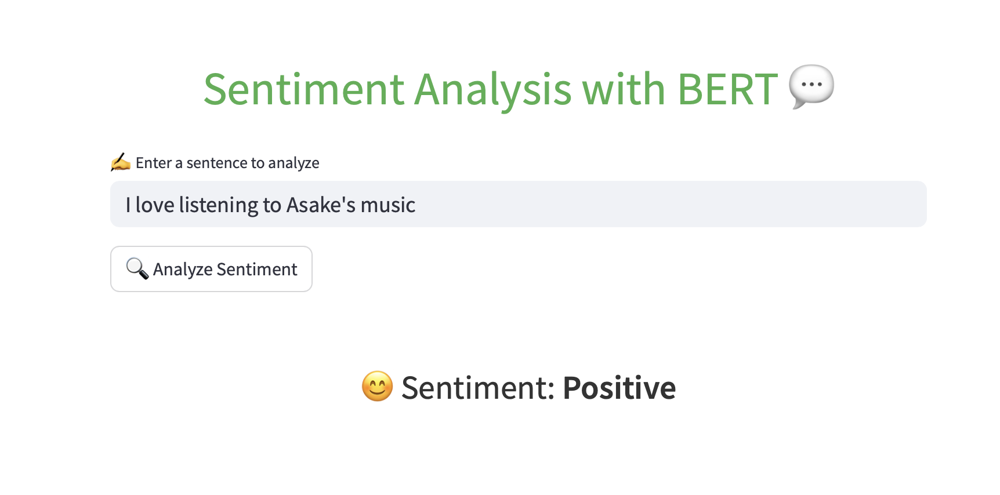
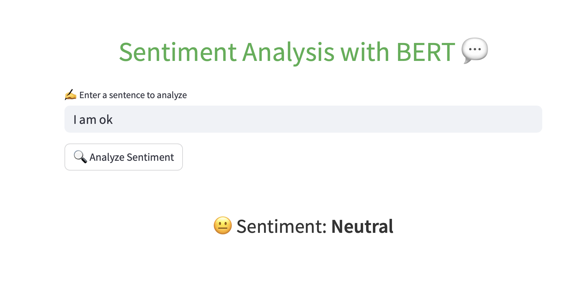
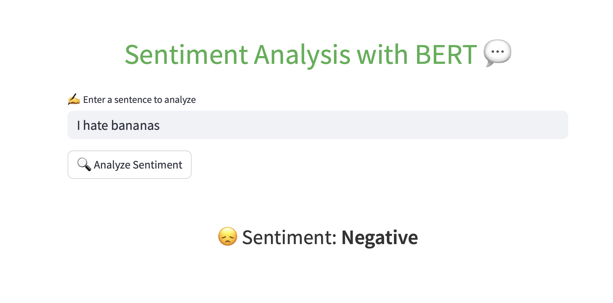
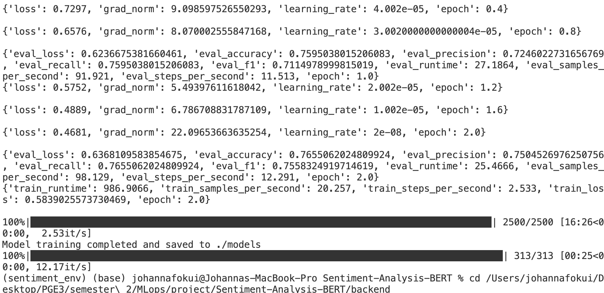

# Collaborative Sentiment Analysis Pipeline using BERT

## Project Overview

This project, developed as part of an **MLOps course**, implements a comprehensive Sentiment Analysis Pipeline using a pre-trained BERT (Bidirectional Encoder Representations from Transformers) model. The pipeline processes app reviews from the Google Play Store, classifying sentiments into three categories—negative (0), neutral (1), and positive (2). It provides an interactive web interface for real-time predictions using Streamlit, containerized with Docker for easy deployment, and automated through GitHub Actions for continuous integration and deployment (CI/CD). The project simulates a professional MLOps workflow, emphasizing best practices such as version control with Git, collaborative development through pull requests and reviews, unit testing with `pytest`, automation scripts using `setup.sh` and `Makefile`, containerization with Docker, CI/CD with GitHub Actions, and detailed documentation.

The dataset used in this project is sourced from Kaggle: **Google Play Store Reviews**, a collection of app reviews for sentiment analysis. You can explore the dataset and related work here: [Sentiment Analysis using BERT on Kaggle](https://www.kaggle.com/code/prakharrathi25/sentiment-analysis-using-bert). If you’re interested in diving deeper into the project or the dataset, the Kaggle link provides additional insights and resources.

## About the Dataset

### Google Play Store Reviews
- **Source**: [Kaggle - Google Play Store Reviews](https://www.kaggle.com/code/prakharrathi25/sentiment-analysis-using-bert)
- **Description**: This dataset contains app reviews collected from the Google Play Store, intended for the task of sentiment analysis. The Google Play Store, formerly known as Android Market, is a digital distribution service operated and developed by Google. It serves as the official app store for certified devices running on the Android operating system, allowing users to browse and download applications developed with the Android software development kit (SDK) and published through Google. With over 82 billion app downloads and more than 3.5 million published apps, it is the largest app store in the world.
- **Last Updated**: 4 years ago (Version 1)
- **Usage in Project**: The dataset is stored in the `data/` directory as `dataset.csv`. To use this dataset, download it from the Kaggle link above and place it in the `data/` directory of the project. Alternatively, you can create a temporary `dataset.csv` file with the required columns (`content` for review text and `score` for rating) for testing purposes.

## 🔹 Project Structure

The project is organized to reflect a professional MLOps workflow, with clear separation of concerns between source code, tests, automation scripts, containers, and CI/CD workflows. Below is the structure of the repository:

```
Sentiment-Analysis-BERT/
├── backend/                   # Source code for the backend container
│   ├── Dockerfile             # Dockerfile for the backend container
│   ├── __init__.py            # Makes backend/ a Python package
│   ├── api.py                 # Flask API for sentiment predictions
│   ├── best_model.py          # Tracks and saves the best model, skips retraining if model exists
│   ├── data_extraction.py     # Loads and preprocesses the dataset
│   ├── data_processing.py     # Handles text cleaning, tokenization, and data splitting
│   ├── inference.py           # Performs inference using the pre-trained model
│   └── model.py               # Trains the BERT model and loads pre-trained model for inference
├── data/                      # Directory for the dataset
│   └── dataset.csv            # Google Play Store Reviews dataset
├── frontend/                  # Source code for the frontend container
│   ├── Dockerfile             # Dockerfile for the frontend container
│   └── front.py               # Streamlit app for the frontend
├── models/                    # Directory for saved BERT model files
│   ├── checkpoint-1250/       # Training checkpoint
│   ├── checkpoint-2500/       # Training checkpoint
│   ├── config.json            # Model configuration
│   ├── model.safetensors      # Pre-trained model weights
│   └── metrics.txt            # Metrics from model evaluation (accuracy, precision, recall, F1)
├── screenshots/               # Directory for project screenshots
│   ├── streamlit_positive.png # Screenshot of Streamlit app showing a positive prediction
│   ├── streamlit_neutral.png  # Screenshot of Streamlit app showing a neutral prediction
│   ├── streamlit_negative.png # Screenshot of Streamlit app showing a negative prediction
│   ├── terminal_tests.png     # Screenshot of terminal showing unit test results
│   └── terminal_training_inference.png # Screenshot of terminal showing backend logs
├── tests/                     # Unit tests for the pipeline
│   └── unit/
│       ├── test_data_extraction.py  # Tests for data extraction
│       ├── test_data_processing.py  # Tests for data processing
│       ├── test_model.py            # Tests for model training
│       └── test_inference.py        # Tests for inference
├── .github/                   # GitHub Actions workflows for CI/CD
│   └── workflows/
│       ├── test.yml           # Workflow for linting and unit tests
│       ├── evaluate.yml       # Workflow for model evaluation
│       └── build.yml          # Workflow for building and publishing Docker images
├── docker-compose.yml         # Docker Compose file for orchestrating backend and frontend containers
├── setup.sh                   # Script to automate environment setup (Unix-based systems)
├── Makefile                   # Makefile with commands for setup, testing, and running (Unix-based systems)
├── README.md                  # Project documentation (this file)
├── requirements.txt           # List of Python dependencies
└── .gitignore                 # Git ignore file for excluding unnecessary files
```

## ⚙️ Setup

Follow these steps to set up the project on your local machine. Instructions are provided for both Unix-based systems (Linux, macOS) and Windows. The recommended way to run the project is using Docker Compose, but manual setup instructions are also provided for development or debugging purposes.

### Prerequisites
- **Docker**: Required for running the containerized application. Install Docker Desktop (for macOS/Windows) or Docker Engine (for Linux): [Docker Installation Guide](https://docs.docker.com/get-docker/).
- **Git**: Required for cloning the repository. Install Git: [Git Installation Guide](https://git-scm.com/downloads).
- **Python 3.9+**: Required for manual setup. Install Python: [Python Downloads](https://www.python.org/downloads/).

### Using Docker Compose (Recommended)

This is the simplest way to run the project, as it handles all dependencies and setup through containers.

1. **Clone the Repository**:
   ```bash
   git clone https://github.com/JoNoubs/Sentiment-Analysis-BERT.git
   cd Sentiment-Analysis-BERT
   ```

2. **Ensure the Dataset is Available**:
   - The pipeline expects the dataset at `data/dataset.csv`. Download the dataset from [Kaggle - Google Play Store Reviews](https://www.kaggle.com/code/prakharrathi25/sentiment-analysis-using-bert) and place it in the `data/` directory:
     ```bash
     mkdir -p data
     # Copy the downloaded dataset.csv to the data/ directory
     ```
   - Alternatively, create a temporary `dataset.csv` file for testing:
     ```bash
     echo "content,score" > data/dataset.csv
     echo "Good movie,5" >> data/dataset.csv
     echo "Bad film,1" >> data/dataset.csv
     echo "Amazing story,4" >> data/dataset.csv
     echo "Bad plot,2" >> data/dataset.csv
     echo "Okay experience,3" >> data/dataset.csv
     ```

3. **Run the Application with Docker Compose**:
   - Start both the backend (Flask API) and frontend (Streamlit app) containers:
     ```bash
     docker-compose up --build
     ```
   - **Expected Output**:
     - The backend container will load the pre-trained model and start the Flask API:
       ```
       Pre-trained model found at models/model.safetensors, skipping training and evaluation.
       Loaded pre-trained model from ./models
       * Serving Flask app 'backend.api'
       * Debug mode: off
       WARNING: This is a development server. Do not use it in a production deployment.
       * Running on all addresses (0.0.0.0)
       * Running on http://127.0.0.1:5000
       * Running on http://172.17.0.2:5000
       ```
     - The frontend container will start the Streamlit app.

4. **Access the Web App**:
   - Open your browser and go to `http://localhost:8501` to interact with the Streamlit app.
   - Enter a text (e.g., “This movie is great!”) and click “Analyze” to see the sentiment prediction.

5. **Stop the Containers**:
   - In the terminal where `docker-compose up` is running, press `Ctrl+C` to stop the containers.

### Manual Setup (For Development or Debugging)

If you prefer to run the project without Docker (e.g., for development or debugging), follow these steps.

#### For Unix-based Systems (Linux, macOS)

1. **Clone the Repository**:
   ```bash
   git clone https://github.com/JoNoubs/Sentiment-Analysis-BERT.git
   cd Sentiment-Analysis-BERT
   ```

2. **Create and Activate a Virtual Environment**:
   ```bash
   python3 -m venv sentiment_env
   source sentiment_env/bin/activate
   ```
   - **Note for macOS Users**: If you encounter a `permission denied` error with `source`, use:
     ```bash
     . sentiment_env/bin/activate
     ```

3. **Install Dependencies**:
   - Install the required packages:
     ```bash
     pip install -r requirements.txt
     ```
   - **Important**: Using the `Trainer` with PyTorch (as in `backend/model.py`) requires `accelerate>=0.26.0`. If you encounter an error like:
     ```
     ImportError: Using the `Trainer` with `PyTorch` requires `accelerate>=0.26.0`: Please run `pip install transformers[torch]` or `pip install 'accelerate>=0.26.0'`
     ```
     Install the `accelerate` package:
     ```bash
     pip install 'accelerate>=0.26.0'
     ```
   - If you encounter a `tf-keras` dependency error (e.g., `ModuleNotFoundError: No module named 'tf_keras'`), install it manually:
     ```bash
     pip install tf-keras
     ```
   - To suppress the `hf_xet` warning when downloading models, install the `hf_xet` package:
     ```bash
     pip install huggingface_hub[hf_xet]
     ```

4. **Verify Installation**:
   - Ensure all dependencies are installed correctly:
     ```bash
     python3 -c "import transformers, torch, pandas, numpy, sklearn, pytest, streamlit, pytest_mock, accelerate, flask; print('All imports successful')"
     ```
     - **Expected Output**: `All imports successful`

5. **Ensure the Dataset is Available**:
   - The pipeline expects the dataset at `data/dataset.csv`. Download the dataset from [Kaggle - Google Play Store Reviews](https://www.kaggle.com/code/prakharrathi25/sentiment-analysis-using-bert) and place it in the `data/` directory:
     ```bash
     mkdir -p data
     # Copy the downloaded dataset.csv to the data/ directory
     ```
   - Alternatively, create a temporary `dataset.csv` file for testing:
     ```bash
     echo "content,score" > data/dataset.csv
     echo "Good movie,5" >> data/dataset.csv
     echo "Bad film,1" >> data/dataset.csv
     echo "Amazing story,4" >> data/dataset.csv
     echo "Bad plot,2" >> data/dataset.csv
     echo "Okay experience,3" >> data/dataset.csv
     ```

#### For Windows

1. **Clone the Repository**:
   - Open a command prompt (cmd) or PowerShell:
     ```cmd
     git clone https://github.com/JoNoubs/Sentiment-Analysis-BERT.git
     cd Sentiment-Analysis-BERT
     ```

2. **Create and Activate a Virtual Environment**:
   - Create the virtual environment:
     ```cmd
     python -m venv sentiment_env
     ```
   - Activate the virtual environment:
     - In Command Prompt:
       ```cmd
       sentiment_env\Scripts\activate
       ```
     - In PowerShell:
       ```powershell
       .\sentiment_env\Scripts\Activate.ps1
       ```
   - **Verification**:
     - Your prompt should change to include `(sentiment_env)`.

3. **Install Dependencies**:
   - Install the required packages:
     ```cmd
     pip install -r requirements.txt
     ```
   - **Important**: Using the `Trainer` with PyTorch requires `accelerate>=0.26.0`. If you encounter an error like:
     ```
     ImportError: Using the `Trainer` with `PyTorch` requires `accelerate>=0.26.0`: Please run `pip install transformers[torch]` or `pip install 'accelerate>=0.26.0'`
     ```
     Install the `accelerate` package:
     ```cmd
     pip install "accelerate>=0.26.0"
     ```
   - If you encounter a `tf-keras` dependency error, install it:
     ```cmd
     pip install tf-keras
     ```
   - To suppress the `hf_xet` warning, install the `hf_xet` package:
     ```cmd
     pip install huggingface_hub[hf_xet]
     ```

4. **Verify Installation**:
   - Ensure all dependencies are installed correctly:
     ```cmd
     python -c "import transformers, torch, pandas, numpy, sklearn, pytest, streamlit, pytest_mock, accelerate, flask; print('All imports successful')"
     ```
     - **Expected Output**: `All imports successful`

5. **Ensure the Dataset is Available**:
   - The pipeline expects the dataset at `data/dataset.csv`. Download the dataset from [Kaggle - Google Play Store Reviews](https://www.kaggle.com/code/prakharrathi25/sentiment-analysis-using-bert) and place it in the `data/` directory:
     ```cmd
     mkdir data
     rem Copy the downloaded dataset.csv to the data\ directory
     ```
   - Alternatively, create a temporary `dataset.csv` file for testing:
     - In Command Prompt:
       ```cmd
       echo content,score> data\dataset.csv
       echo Good movie,5>> data\dataset.csv
       echo Bad film,1>> data\dataset.csv
       echo Amazing story,4>> data\dataset.csv
       echo Bad plot,2>> data\dataset.csv
       echo Okay experience,3>> data\dataset.csv
       ```
     - In PowerShell:
       ```powershell
       "content,score`nGood movie,5`nBad film,1`nAmazing story,4`nBad plot,2`nOkay experience,3" | Out-File -FilePath data\dataset.csv -Encoding utf8
       ```

## Usage

The project provides several ways to interact with the sentiment analysis pipeline. In Part 2, we containerized the application into backend and frontend services, so the primary way to interact with the system is through Docker Compose. Manual usage instructions are also provided for development or debugging purposes.

### Using Docker Compose (Recommended)

This is the simplest way to run the project, as it handles all dependencies and setup through containers.

1. **Run the Application with Docker Compose**:
   - Start both the backend (Flask API) and frontend (Streamlit app) containers:
     ```bash
     docker-compose up --build
     ```
   - **Expected Output**:
     - The backend container will load the pre-trained model and start the Flask API:
       ```
       Pre-trained model found at models/model.safetensors, skipping training and evaluation.
       Loaded pre-trained model from ./models
       * Serving Flask app 'backend.api'
       * Debug mode: off
       WARNING: This is a development server. Do not use it in a production deployment.
       * Running on all addresses (0.0.0.0)
       * Running on http://127.0.0.1:5000
       * Running on http://172.17.0.2:5000
       ```
     - The frontend container will start the Streamlit app.

2. **Access the Web App**:
   - Open your browser and go to `http://localhost:8501` to interact with the Streamlit app.
   - Enter a text (e.g., “This movie is great!”) and click “Analyze” to see the sentiment prediction.
   - **Screenshots**:
     - Positive Prediction:  shows the Streamlit app predicting "Positive".
     - Neutral Prediction:  shows the Streamlit app predicting "Neutral".
     - Negative Prediction:  shows the Streamlit app predicting "Negative".

3. **Stop the Containers**:
   - In the terminal where `docker-compose up` is running, press `Ctrl+C` to stop the containers.

### Manual Usage (For Development or Debugging)

For debugging or local development without Docker, you can use the scripts directly.

- **Perform Inference**:
  - Use the pre-trained model to predict the sentiment of a sample text:
    ```bash
    python -m backend.inference
    ```
    - **Expected Output**: `Sentiment for 'This movie is amazing!': Positive`
    - **Note for Windows Users**: Use the same command:
      ```cmd
      python -m backend.inference
      ```

## Makefile Commands (Unix-based Systems)

For Unix-based systems (Linux, macOS), the project includes a `Makefile` to simplify common tasks. Use the following commands:

- `make setup`: Sets up the virtual environment and installs dependencies.
  ```bash
  make setup
  ```

- `make test`: Runs all unit tests to verify the pipeline components.
  ```bash
  make test
  ```
  - **Screenshot**: `screenshots/terminal_tests.png` shows the terminal output of running `make test`, displaying successful unit test results.

- `make run`: Performs inference on a sample text using the pre-trained model.
  ```bash
  make run
  ```

### For Windows Users
- The `Makefile` is designed for Unix-based systems and may not work directly on Windows unless you have a Unix-like environment (e.g., WSL, Git Bash, or Cygwin). Instead, you can run the equivalent commands manually:
  - **Setup**:
    ```cmd
    python -m venv sentiment_env
    sentiment_env\Scripts\activate
    pip install -r requirements.txt
    pip install "accelerate>=0.26.0"
    pip install tf-keras
    pip install huggingface_hub[hf_xet]
    ```
  - **Test**:
    ```cmd
    pytest tests\unit\ -v
    ```
  - **Run**:
    ```cmd
    python -m backend.inference
    ```

## MLOps Workflow

This project was developed as part of an MLOps course, simulating a professional software development environment. Key MLOps practices implemented include:

- **Version Control**: Used Git for version control, with feature branches (`feature-data-extraction`, `feature-data-cleaning`, etc.) and pull requests for collaborative development.
- **Collaboration**: Johanna and Armel collaborated through GitHub pull requests and reviews, ensuring code quality and shared understanding.
- **Unit Testing**: Comprehensive unit tests were written using `pytest` to validate each component of the pipeline (`data_extraction`, `data_processing`, `model`, `inference`).
- **Automation**: Automated setup with `setup.sh` and `Makefile` (for Unix-based systems), and CI/CD with GitHub Actions for testing, evaluation, and deployment.
- **Error Handling**: Improved error handling in `backend/model.py` and `backend/inference.py` to manage small datasets and runtime errors gracefully.
- **Containerization**: Split the application into backend (Flask API) and frontend (Streamlit app) containers, orchestrated with Docker Compose.
- **CI/CD**: Implemented GitHub Actions workflows for linting, testing, model evaluation, and Docker image publishing.
- **Documentation**: Detailed documentation in `README.md`, covering the project overview, setup, usage, and contributions.

## Containerization and CI/CD

### Docker
- **frontend/Dockerfile**: Builds the frontend container, running the Streamlit app (`front.py`) on port 8501.
- **backend/Dockerfile**: Builds the backend container, running the Flask API (`api.py`) on port 5000, with a volume for `models/` to persist the pre-trained model.
- **docker-compose.yml**: Defines `frontend` and `backend` services, connected via a `sentiment-network` bridge for communication.
  - **Backend Logs Screenshot**:  shows the terminal output of the backend container starting up, loading the pre-trained model, and running the Flask API.

### GitHub Actions
- **test.yml**: Lints the code with `flake8` and runs unit tests using `pytest` on pushes and pull requests to the `main` branch.
- **evaluate.yml**: Evaluates the model’s performance after tests, storing metrics (accuracy, precision, recall, F1) in `metrics.txt`, and fails if accuracy is below 70%.
- **build.yml**: Builds and pushes the backend and frontend Docker images to Docker Hub on pushes to the `main` branch.

### GitHub Actions Workflow Diagram
```
[Push/Pull Request] --> [Test Workflow] --> [Lint & Test]
                    |
                    v
            [Evaluate Workflow] --> [Evaluate Model]
                    |              (Store metrics.txt)
                    v
            [Build Workflow] --> [Build & Push Docker Images]
```

### Docker Hub Secrets
To enable the `build.yml` workflow to push Docker images, set up the following secrets in your GitHub repository:
- `DOCKER_LOGIN`: Your Docker Hub username.
- `DOCKER_PWD`: Your Docker Hub password or access token.
- **Instructions**: Go to your repository on GitHub, navigate to `Settings > Secrets and variables > Actions`, and add these secrets.

## Explore More

If you’d like to explore the project further, check out the Kaggle notebook where the dataset was sourced and additional sentiment analysis work was done: [Sentiment Analysis using BERT on Kaggle](https://www.kaggle.com/code/prakharrathi25/sentiment-analysis-using-bert). The notebook provides insights into the dataset and alternative approaches to sentiment analysis using BERT.

## Contributing

We welcome contributions to enhance this project! Here’s how you can contribute:

1. **Fork the Repository**:
   - Fork the repository to your GitHub account by clicking the "Fork" button on the repository page.

2. **Clone Your Fork**:
   ```bash
   git clone https://github.com/YOUR_USERNAME/Sentiment-Analysis-BERT.git
   cd Sentiment-Analysis-BERT
   ```

3. **Create a Branch**:
   - Create a new branch for your feature or bug fix:
     ```bash
     git checkout -b feature/your-feature-name
     ```

4. **Make Changes**:
   - Implement your changes, ensuring to follow the project’s coding style and structure.
   - Add or update unit tests in the `tests/unit/` directory as needed.
   - Update the documentation in `README.md` if your changes affect setup or usage.

5. **Test Your Changes**:
   - Run the unit tests to ensure your changes do not break existing functionality:
     ```bash
     pytest tests/unit/ -v
     ```
   - Test the application with Docker Compose:
     ```bash
     docker-compose up --build
     ```

6. **Commit and Push**:
   - Commit your changes with a clear message:
     ```bash
     git add .
     git commit -m "Add your-feature-name with description"
     git push origin feature/your-feature-name
     ```

7. **Create a Pull Request**:
   - Go to your fork on GitHub and create a pull request to the `main` branch of the original repository (`JoNoubs/Sentiment-Analysis-BERT`).
   - Provide a detailed description of your changes, including any issues addressed and new features added.
   - The pull request will trigger the GitHub Actions workflows (`test.yml`, `evaluate.yml`, `build.yml`) to ensure your changes meet the project’s standards.

## Acknowledgments

- Thanks to Kaggle for providing the Google Play Store Reviews dataset.
- Special thanks to the Hugging Face team for the `transformers` library and `accelerate` package, which made working with BERT seamless.
- Gratitude to the Streamlit team for their excellent framework for building interactive web apps.
- Thanks to the Docker team for providing tools for containerization and orchestration.
- Appreciation to GitHub for enabling CI/CD workflows through GitHub Actions.

